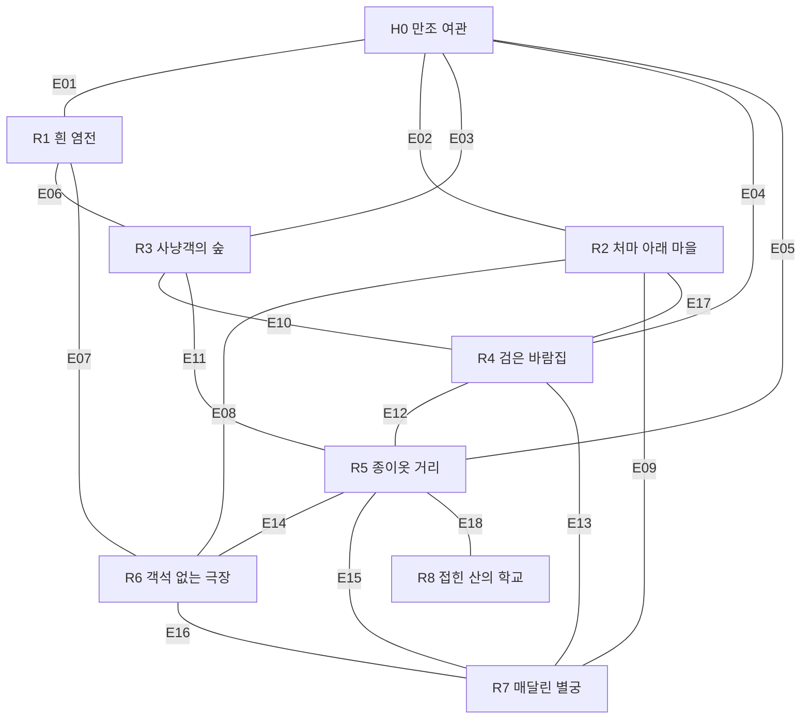
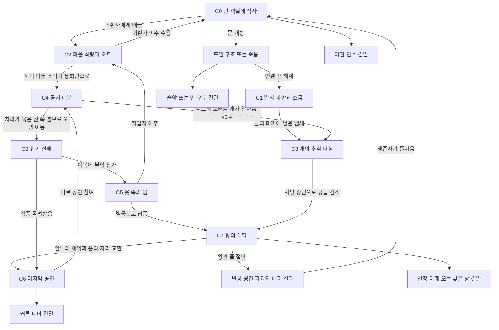

# 새 세계 지도·독립 집필 정본 v0.4

상태: 제작 초안, 사용자 내용 승인 전. [World 초안](../15_NEW_WORLD.md)의 지리·참여자·사건을 상세 집필의 공통 입력으로 사용한다. 이 파일은 그림 생성 입력이나 런타임 콘텐츠가 아니다. 통합 담당만 수정한다. v0.3·v0.4 변경은 §6 끝과 World §0에 적었다.

## 1. 큰 지도

북쪽이 산, 남쪽이 바다다. x/y는 지도 도식 좌표로 실제 이동 단위가 아니다. 화면은 지면 하향 60도 정사영이며 아래 배치도를 그대로 배경으로 그리지 않는다.

| 지역 | 도식 중심(x,y) | 지세 / World의 장면 구역 |
|---|---|---|
| H0 만조 여관 | (0,0) | 해안 둔덕; 세탁실→식당→복도→마당→지붕 |
| R1 흰 염전 | (-3,2) | 조간대; 말뚝길→채염판→창고→구덩이→바닷문 |
| R2 처마 아래 마을 | (-4,0) | 해안 함몰부; 기울어진 집→부엌→우물→빨랫배→묻힌 집 |
| R3 사냥객의 숲 | (-3,-3) | 북서 구릉; 개장→오두막→성상→고기길→빈 사냥터 |
| R4 검은 바람집 | (0,-3) | 절벽 내부; 송풍실→계단→필터실→성가석→막힌 출구 |
| R5 종이옷 거리 | (3,-2) | 산 아래 계단 거리; 재단집→염색 물길→건조대→작업장→비탈 |
| R6 객석 없는 극장 | (3,2) | 바다 향한 절벽; 표창구→무대→객석 터→분장실→지하 입 |
| R7 매달린 별궁 | (5,0) | 동쪽 절벽 상단; 계단→식사방→초상 복도→왕의 방→천장 |
| R8 접힌 산의 학교 | (4,-5) | 동북 산; 평평한 오르막→직조실→접기실→절단실→빠진 교실 |

화살표 없는 링크는 양방향 통로다. 조건과 폐쇄 후 귀환은 World §3.1을 따른다. 입구 다섯 개와 후반 우회 고리를 삭제하지 않는다.

## 2. 뒤틀림을 만드는 규칙

이것은 게임에 나오는 설명이 아니라 집필자가 검사하는 제작 절차다. 모든 사건을 한 수식으로 생성하지 않는다.

1. **당사자의 구체 행동을 먼저 적는다.** 어떤 장소에서 누구 손으로 무엇을 만지고, 왜 지금 멈추지 못하는가. '권력의 모순', '정체성 위기'는 행동을 대신하지 못한다.
2. **어긋나는 지점을 고른다.** 인식/몸/물질/공간/관습/시간 중 실제 사건에 필요한 것만 고른다. 모든 축을 한 사건에 넣지 않는다.
3. **핵심 상호작용의 뒤틀림은 행위에 드러낸다.** 모양만 바뀐 문, HP만 높은 살덩이, 공략이 같은 이름 다른 보스로 핵심 사건을 채우지 않는다. 무엇을 자르고 어디에 놓고 누구를 데려가는지가 달라져야 한다. 분위기와 생활의 모든 디테일에 기능·보상·분기를 강제하는 규칙은 아니다.
4. **물질의 행방을 제작 정본에 적는다.** 없어진 몸·먹이·옷·열·물은 어떻게 남고 누가 처리하는가. 일부 잔해는 다시 만날 수 있지만, 모든 잔해에 접근·조작·정답 확인을 보장하지 않는다. 목격만 가능한 현상과 영구히 닿지 않는 곳도 둔다.
5. **인물은 자기에게 중요한 것에 반응한다.** 전원이 놀라거나 전원이 무덤덤한 문법을 반복하지 않는다. 자신의 옷을 걱정하거나 웃음을 참거나 다른 사람을 탓하는 구체 반응을 쓴다.
6. **인과의 일부를 실제로 잃게 한다.** 먼저 완전한 제작 인과를 작성하고, 사라진 증언·공간·물건을 지정한다. 삭제한 자리에 정답 해설을 다른 NPC로 옮기지 않는다.
7. **인접 사건과 비교한다.** 직전 사건과 같은 '도와줌→다른 사람 희생', '소중한 사람을 먹음', '기관이 인정 안 함', '몸이 합쳐짐'이면 재료·결과 이름만 바꿔 통과시키지 않는다. 관계나 조작, 피해의 발생 구조를 다시 쓴다.
8. **불쾌함을 정당화하지 않는다.** 신체적 역겨움에 매번 철학적 효용이 있어야 하는 것은 아니다. 반대로 피/내장 수식어를 늘리는 것으로 사건을 완성하지도 않는다.
9. **원전을 먼저 정한다.** (v0.4) World §4.2·§3.2의 원전에서 알아볼 사물·장면 둘 이상을 공간이나 행동에 둔다. 원전의 문장·삽화·현대 각색 디자인은 쓰지 않고, 원전 제목을 대사나 문서로 말하지 않는다. 원전 줄거리를 그대로 옮기지 않는다.
10. **밝은 겉면과 웃음을 먼저 만든다.** (v0.4) 플레이어가 먼저 웃거나 좋아하게 될 것을 만들고, 그 밑이나 옆에 역겨운 것을 둔다(World §13.3).
11. **순한맛이면 다시 쓴다.** (v0.4) 보기만 하는 불쾌함은 기준 장면이 아니다. World §13.4 기준에 못 미치면 `REVISE`다. 경계(아이·태아·임신, 성적 장면 제외)는 넘지 않는다.

검수에는 [BLACK SOULS 2 조사](../../../../docs/research/top_down_action_rpg/BLACK_SOULS_2_RESEARCH.md)와 [인터뷰의 레퍼런스 조사 2](../docs/GRILLING_STATE.md)의 구체 사례를 사용한다. 원작 인물·대사·사건 자체를 변장 복제하지 않는다.

### 탈락 질문

- 이름과 살/피 단어를 지우면 평범한 배달·허가·구출 퀘스트만 남는가?
- 인물 소개 첫 문장으로 사건의 도덕적 결론을 예상할 수 있는가?
- 다른 지역 인물 이름을 넣어도 대사와 선택지가 그대로 성립하는가?
- 플레이어는 무슨 일이 일어났는지 경험하지 않고 설명만 받는가?
- 애정과 생존이 숫자 한 개로 자동 보장되는가?
- 장면의 고유성을 설명할 때 형용사밖에 없는가?
- 직업과 숨긴 비밀을 지우면 그 인물만의 장면이 둘 이상 남는가? 그중 하나는 관계나 사건을 실제로 움직이는가? (v0.3)
- 이 연결의 원인이 바로 앞 연결과 같은 '살리면 다른 쪽이 소모'인가? (v0.3, §3 표)
- 메모 소재를 쓰면서 옛 세계에서 그 소재가 맡았던 지역 역할과 피해 배치까지 옮겨 왔는가? (v0.3, §7)
- 첫 만남에서 이 인물 때문에 웃거나 이 인물을 좋아할 이유가 하나도 없는가? (v0.4, World §4.3)
- 모든 인물이 한두 마디로 끝나는 같은 말투인가? (v0.4, World §13.3)
- 밝은 겉면 없이 낡고 젖은 것만 있는가? (v0.4, World §3.2)
- 역겨움이 보기만 하는 수준이거나, 사람 몸으로 만든 것을 먹고·입고·덮고·만지는 행동이 없는가? (v0.4, World §13.4)
- 원전을 알아볼 사물·장면이 없는가? 반대로 원전 줄거리를 그대로 옮겼는가? (v0.4, World §4.2)

해당하면 `REVISE`로 남긴다. 이를 통과했다고 사용자 취향 검수를 통과한 것은 아니다. '조작할 수 없다', '보상이 없다'는 탈락 사유가 아니다. 목격만 하는 장면과 영구히 닿지 않는 흔적도 통과할 수 있다(v0.3, 독립 검토 P1-2).

## 3. 플로우차트 선행 계약

최종 조건 수치보다 먼저 교차 사건의 입력/출력과 순서를 고정한다. 아래 흐름은 가능한 연결이고, 모든 플레이에서 자동 실행되는 연쇄가 아니다. 실제 효과는 사건 조건과 NPC 생존을 다시 확인한다.

재귀 자동 실행 금지: C6→C4, C2→C0 같은 재진입은 새 플레이어 행동/새 공연/새 저녁이 있을 때만 평가한다. 이미 소비된 식량·사망·납품을 재방문만으로 중복 적용하지 않는다. 이것은 새로운 구현 규칙이 아니라 기존 원자적 결과/저장 계약의 콘텐츠 적용이다.

v0.3부터 모든 연결에 원인 유형을 적는다. 한 경로에서 '자원 소모'나 '비용 전가'(살리면 다른 쪽이 소모되는 연결)가 연달아 두 번 오지 않는다. 새 연결을 제안하는 담당은 이 표의 유형을 함께 적고 root가 검사한다.

| 연결 | 원인 유형 | 선행 사실 | 즉시 남는 것 | 지연 실행 조건 | 막거나 바꾸는 행동 |
|---|---|---|---|---|---|
| C0→C2 | 자원 소모 | 문틈 운반이 실제로 일어남 | 여관 곡물 감소 | 다음 곡물 배달 | 새 재료 확보/귀환자 이주 |
| C0→D | 공간 행동 | 5호 문을 엶 | 구덩이·끈·도엘이 드러남 | 발 분리 또는 끈 해제 | 끈 먼저 해제/문 닫기 |
| D→C1 | 몸의 연결 | 의족 끈 해제 뒤 도엘 생존 | 발 처치 요청 | 무연 방문 또는 절단 도구 확보 | 발 유지/요청 거절 |
| C1→C3 | 흔적 | 발에 소금을 덧바르거나 씻음, 미끼를 지님 | 발과 미끼의 냄새 | 다음 숲 진입 | 씻기/미끼 버리기 |
| C2→C0 | 사람 이동 | 마을이 귀환자 이주를 받아들임 | 비는 객실 | 다음 식사 시각 | 이주 거부/객실 잠금 |
| C2→C4 | 착각 (v0.3) | 오트 셋의 창가 자리 다툼, 부엌 통화관 뚜껑 열림, 차라 생존 | 차라가 산 쪽 밸브를 손수건으로 묶음 | 다음 송풍 작동 | 뚜껑 닫기/차라를 저녁 자리로 데려감/매듭 자르기(차라가 관 안으로 들어감) |
| C4→C8 | 개인 행동의 물질 결과 | 산 쪽 밸브가 열림(차라의 매듭 또는 플레이어의 전환) | 배관 방향·산 농도 변화 | 학생 다음 실습 | 필터·실습 중지·농도 분산 |
| C8→C5 | 비용 전가 | 페른 생존·부담 전가 선택 | 예복의 숨은 연결 | 그 예복 수선/착용 | 작품 회수·연결 절단 |
| C5→C7 | 물건 이동 | 예복 완성·납품 | 궁의 옷과 접근 상태 | 왕 기립/급식 | 납품 중단·다른 틀 사용 |
| C5→C2 | 사람 이동 | 재단 작업자가 마을로 옮김 | 부엌의 새 일손, 비는 작업대 | 다음 배급 | 이주 막기/작업장 복구 |
| C3→C7 | 자원 소모 | 사냥 공급 중단 | 궁 재고 감소 | 다음 급식 사건 | 다른 식량·왕 급식 중단 |
| C7→C6 | 사적 선택 | 안느 생존·식사 거부 뒤 공연 예약 | 무대에 맡긴 옷과 옮긴 의자 | 옴이 관객 자리로 이동 | 옷 반환·등솔기 절단·공연 중단 |
| C6→C4 | 사적 순서와 몸의 부담 | 니르 생존·껍질 놀이를 끝낸 뒤 공연 참여 | 호흡 부담/박자 변화 | 다음 성가 장치 작동 | 쉬기·대체 응답·역풍 차단 |
| C4→C3 | 알아봄 (v0.4) | 니르·벤·개 생존. 개가 들을 수 있는 곳에서 니르가 노래함(예: 벤이 사냥 체험 개막 노래를 맡김, 플레이어가 동행 중 노래를 청함) | 니르의 둘째 폐가 옛 사냥관의 부름을 부르고, 개들이 목줄을 쥔 사람을 문다(D05). 목줄을 쥔 사람이 벤이면 벤이 물려 죽는다 | 즉시 | 노래 전에 개를 묶기·목줄을 다른 기둥에 걸기·니르를 다른 곳에서 노래하게 하기. R3·R4·N04·N05 상세에서 조건을 확정 |
| C8→C6 | 물건 이동 | 돌려받은 무대 천이 극장으로 감 | 새 막 | 다음 공연 | 작품 보관/다른 사람에게 반환. R6·R8 상세에서 확정 |
| C7→R | 공간 파괴 | G7 통과 뒤 G8에서 왕관 줄 절단 | 천장 낙하와 하층 대피 결과 | 즉시 | 대피 유도/절단하지 않음 |
| R→C0 | 사람 이동 | 별궁 파괴·대피 생존 | 여관 피난자 배치 | 다음 식사 시각/객실 방문 | 빈 방 확보·다른 거처 |

v0.2의 C2→C4 '지방 연료 공급'은 연결에서 뺐다. 마로의 지방 통이 부엌 분산기를 돌리고, 통을 태우면 분산기가 멈춰 부엌이 오염되는 일은 R2 안의 결과로 남는다(World §4.1 마로 행).

각 담당은 이 조건을 다른 인물의 대사로 자동 충족시키지 않는다. 조건 변경이 필요하면 root에게 제안하며 자신의 파일에 새 정본처럼 쓰지 않는다.

### 3.1 C0 원자 경계 v0.3

H0·N01 상세가 함께 요청한 잠금이다. 06 enum과 stage 수치는 C0 사건 명세에서 정하고, 여기서는 순서·원인·확정 시점만 고정한다.

귀환자 굶주림은 C0의 지역 상태 네 단계다: `배부름 → 긁음 → 문틈 손 → 말기`. 게임 시작은 `문틈 손`이다. 도엘이 다리를 잃은 뒤 19일 동안 문틈에 접시를 넣은 사람이 없었고, 소하가 두 걸음 뒤에서 바닥으로 밀어 둔 접시 가운데 문틈으로 나온 손이 닿은 것만 먹혔다. 게임 중에도 소하의 밀어 두기는 한 몫이 되지 않아 운반으로 세지 않는다.

| 무엇 | 언제 | 확정되는 것 |
|---|---|---|
| 식사 시각 | H0 밖에서 관문(G1–G8) 또는 보스 조우(K13–K25) 결과가 하나 확정될 때마다 한 번. 대화·휴식·재방문·이동은 식사 시각을 만들지 않는다 | 직전 식사 시각 뒤 운반자(플레이어 또는 확정된 다른 운반자)가 문틈에 음식을 한 몫 이상 넣었으면 한 단계 내려가고, 아니면 한 단계 오른다. 여관에 식량이 없으면 운반과 무관하게 오른다 |
| 굶어 죽음 | `말기`에서 식사 시각이 한 번 더 지날 때 | 잠긴 방의 귀환자는 그 자리에서 죽는다(H0 §3의 시체 규칙). 잠금이 풀린 방의 귀환자는 복도로 나온다(K01) |
| 공격 진행 | 문 잠금 해제, 굶주림 단계 변화, 소하의 식당 진입 중 하나가 확정된 직후 한 번 평가. 1–4호의 잠금이 모두 풀렸고 `말기`이며 소하가 식당에 있으면 참 | C0에 `소하 공격 진행`을 기록한다. 귀환자가 식당으로 모이고 K12가 열린다. 마지막 문을 여는 선택 자체는 소하를 죽이지 않는다 |
| 결과 1 | 공격 진행 중 K12 승리 | 소하 `wounded`. K12의 귀환자 사망. 공격 진행 해제 |
| 결과 2 | 공격 진행 중 H0가 식당 밖에 지정한 유인점에 음식을 한 몫 이상 놓음(N01 SH-LURE) | 소하 `alive`. 귀환자는 유인점으로 가고 굶주림이 한 단계 내려간다. 공격 진행 해제 |
| 결과 3 | 공격 진행 중 플레이어가 E01–E05로 H0를 벗어남, 회복 후 H0 밖에서 재개, 또는 플레이어가 H0 밖에 있을 때 공격 진행이 참이 됨 | 소하 `dead`(원인: 귀환자). 귀환자는 식당에 남는다 |
| 결과 없음 | K12 패배·플레이어 사망 | [08](../08_SAVE_DEATH_AND_RECOVERY.md) §5.1대로 조우 상태만 되돌린다. 공격 진행은 남고 소하 상태를 쓰지 않는다 |

- 소하의 생존 상태는 위 결과로만 쓴다. 전투 승리와 사망을 함께 출력하지 않는다. 플레이어의 소하 공격(N01 SH-STRIKE)은 K12와 다른 조우이며 별도 원인으로 기록한다.
- 소하는 한 달 전부터 문 앞 팔 길이 안에 들어가지 않는다. 운반자가 될 수 없고 문을 잠그거나 열지도 않는다. 1–4호는 그 전부터 잠겨 있었고 5호는 그날 이후 잠기지 않았다. 열쇠 고리는 소하의 앞치마 안주머니에 있다(N01 SH-KEY). 5호에는 열쇠가 필요 없으므로 도엘 구조는 관계 단계에 잠기지 않는다.
- 운반은 C0→C2로 여관 곡물을 실제로 쓴다. 식사 시각 자체는 곡물을 쓰지 않는다.
- 5호의 귀환자는 같은 사람의 몸 셋이다. 다른 방의 수는 H0 상세가 정한다.
- (v0.4, R1 연결 요청 확인) 한 조작으로 관문과 보스 결과가 같은 프레임에 확정되면 식사 시각을 두 번 적용한다(R1 §6.3의 K14+G1). 그 사이에 운반할 틈은 없다. 춤 박자(§3.3)도 같게 센다.

### 3.2 관계 전이 해석 v0.3

[04](../04_CHARACTERS_AND_RELATIONSHIPS.md) §1.2.1의 'DAG'와 '비가역 전이에는 되돌아가는 edge'가 N01 상세에서 부딪혔다. 스키마 소유자인 [06](../06_AUTHORED_CONTENT_AND_DATA.md) §5.7 예시가 서로 되돌아가는 가역 전이 쌍(t_04/t_05)을 쓰므로 새 세계는 다음처럼 읽는다. 옛 예시의 인물과 상태 이름은 새 세계로 옮기지 않는다.

- `is_irreversible: false` 전이는 서로 되돌아가는 쌍을 가질 수 있다. 되돌아가려면 새 행동이 필요하다(N01 Q4→Q1의 물건 반환).
- `is_irreversible: true` 전이로 들어간 상태에서 원래 상태로 돌아가는 edge는 두지 않는다. 04의 '되돌아가는 edge'는 그 상태에서 다른 상태로 나가는 출구 하나로 읽는다(04 §3의 기존 예시와 같은 방식).
- 비가역 전이만 모은 그래프에는 순환이 없어야 한다.
- 사망은 관계 상태가 아니다. 전역 생존 입력이 모든 생전 전이를 막는다.
- (v0.4 통합 결정 I4-03) 소하 관계는 06 바인딩 때 `exclusions.max_final_state: 2`로 두고 Q6·Q7을 둘 다 끝 상태로 남긴다. 06은 2 이상을 허용한다(06의 sink 규칙). 다른 인물도 끝 상태가 둘 이상이면 같은 방식으로 값을 적는다.

### 3.3 춤 박자 v0.4 — 진행이 미는 몰살

인터뷰 B6(원작 진행도 10의 광기)의 문법을 새 세계 사건으로 옮긴다. 조건이 정해져 있고 10 전에 막을 수 있으므로 무작위 몰살이 아니며, 전원 사망을 강제하지 않는다. 제작 사실은 World §6.3이다.

| 무엇 | 규칙 |
|---|---|
| 세는 법 | 식사 시각(§3.1)과 같은 신호. H0 밖에서 G1–G8 또는 K13–K25 결과가 하나 확정될 때마다 박자 +1. 같은 프레임의 두 결과는 +2. 되돌린 조우의 재도전 종료는 새 결과로 센다. 최대 21 |
| 대상 | R5에서 지은 구두를 신고 있는 사람. 핵심 인물과 주민 모두 |
| 1–3 | 서 있을 때 발끝이 박자를 친다 |
| 4–6 | 일하는 중에도 발을 구른다. 인물마다 우스운 사고 한 장면(예: 소하가 접시를 떨어뜨림, 마로가 국자를 박자에 맞춰 휘두름) |
| 7–9 | 밤마다 해안 길에 나가 춤추고 새벽에 돌아온다. 물집·피·빠진 발톱. 대화 중 한 줄이 박자에 끊긴다 |
| 10 | 10이 확정되는 순간 판정한다. 대상은 죽는다(원인: 춤). 플레이어와 같은 구역에 있으면 춤추며 가장 가까운 바다 쪽 출구로 나가는 장면이 나오고, 따라가면 물가에 구두만 남는다. 다른 곳의 대상은 화면 밖에서 같은 일을 겪는다 |
| 남는 것 | 각자 늘 있던 자리에 발뼈가 든 구두 한 켤레. 밑창이 아직 박자를 친다(인터뷰 G3). 그 인물의 서비스와 사건은 닫힌다 |
| 전체를 막기 | 10 전에 R7의 붉은 구두를 태우거나 부순다 → 박자가 멈추고 증상이 걷힌다. 몸의 상처는 남는다 |
| 늘지 않게 하기 | 10 전에 지르가 죽거나 의식에 설 수 없게 되거나(예: 왕에게 서라고 명령해 교체된 다리가 지르에게서 찢겨 나감, World §4.1), R4–R7 환기 벽(E13)의 통화관이 막힌다 → 박자가 더 늘지 않는다. 이미 오른 단계의 증상은 남는다(7–9면 밤마다 춤추고 다친다) |
| 한 사람 구하기 | 그 사람의 구두를 벗기거나 빼앗는다 → 그 사람만 면한다. 맨발이 된 뒤의 불편과 반응은 인물 담당이 쓴다 |
| 면제 | 맨발(귀환자 대부분), 한 발뿐인 사람(도엘), 판정 순간 물속에 있는 사람(잠수 중인 테사), R5 밖에서 지은 구두, 이미 죽었거나 떠난 사람. 플레이어는 발끝이 박자를 치지만 10에 죽지 않고, 10의 밤에 춤추는 사람들 사이를 걸을 수 있다 |

- 박자 수는 화면에 표시하지 않고 누구도 세어 주지 않는다.
- 첫 회차에 보스를 성실하게 잡은 플레이어는 R7에 닿기 전에 10을 넘기기 쉽다. 의도다.
- 굶주림(§3.1)과는 별개 판정이며 같은 신호로 둘 다 움직인다.
- 원천인 지르는 플레이어가 좋아하게 되는 인물로 쓴다(World §4.3).
- 담당은 자기 지역·인물의 1–3, 4–6, 7–9, 10 모습과 남는 것을 적는다(§4 15항, §5 13항).

## 4. 지역 담당의 납품

지역 한 명이 다음 전체를 소유한다. 일부를 '분위기에 맞게'로 넘기지 않는다.

1. 5구역 각각의 크기·층고·시점 기준, 출입 위치·폭·방향, 통행·가림·상호작용 위치와 내부 연결표.
2. 지역 주민의 먹기·자기·일하기·죽은 몸 처리, 물건과 재료의 들어오고 나가는 길.
3. 모든 주요 물건의 기본 상태·만질 수 있는 행동·즉시 결과·지연 결과·빈 자리·재방문 상태.
4. NPC 입장/퇴장/위치 조건. 인물 대사 정본을 중복 집필하지 않고 해당 인물 파일에 연결.
5. 적/조우/위험과 비전투 우회. 전투 수치 시스템을 새로 발명하지 않음.
6. 지도와 사건표에 걸린 외부 입력/출력·시간 순서·인물 사망 후 대체 통행과 영구 상실.
7. 제작자가 아는 사건 전말, 게임에 남길 흔적, 실제 삭제하는 문서·대사·공간.
8. 이미지 자산 목록·레이어·소리·두 재방문 차분. 이미지 생성은 하지 않음.
9. 시작→탐험→사건→실패/성공→재방문 플레이 과제. 미작성 항목과 판단이 필요한 사항을 명시.
10. 지역 안에서 만드는 게임 속 문서·흔적의 ID는 지역 접두어(H0-T1 식)를 쓴다. World의 D 번호는 통합 정본 전용이다. (v0.3)
11. 역겨움 장면마다 접촉 방식(먹기·입기·만지기·씻기·숨쉬기·보기)을 적어, 그 지역의 불쾌함이 한 방식에 몰렸는지 스스로 보인다. 비율을 맞추라는 뜻은 아니다. (v0.3)
12. 원전 표시: World §3.2·§4.2의 원전에서 공간에 놓은 사물·장면 둘 이상, 비튼 점, 쓰지 않은 것(원전 문장·현대 각색·아이 장면). (v0.4)
13. 밝은 겉면과 그 밑: 주민이 매일 손보는 겉면의 사물, 그 밑이나 옆의 역겨운 것, 두 층이 한 화면에 보이는 위치. (v0.4)
14. 역겨움 기준 장면 둘 이상(World §13.4). 플레이어가 먹고·입고·덮고·손을 넣는 입력과 나중에 뜻이 바뀌는 시점을 적는다. (v0.4)
15. 춤 박자(§3.3): 그 지역 사람들의 1–3, 4–6, 7–9, 10 모습, 10 뒤 남는 것의 위치, 면제되는 사람. (v0.4)

## 5. 인물 담당의 납품

캐릭터 한 명의 외형/목소리/대사/행동/관계/죽음은 한 명이 소유한다.

1. 성인 외형: 비율·얼굴 면·머리·피부·손·옷의 구조와 실루엣, 소지품과 몸의 변화. A의 인물 정체성 복제 금지. B 원본·크롭 사용 금지.
2. 실제 욕구·혐오·버릇·말하지 않는 것·지식 경계·거짓말. 전원이 비밀을 가진 친절한 직원이 되지 않음.
3. 등장/재방문/관계/동행/서비스/거절/적대/죽음 직전/주변인 사망에 대한 실제 대사. 문서 페이지/선택/focus 계약 준수.
4. 행동별 선행 조건·플레이어 입력·물건/몸의 결과·지연 결과·취소/실패. 다른 인물의 결과를 임의 소유하지 않음.
5. 관계 전이와 생존 전이를 구별. 호감이 높아도 조건을 밟으면 죽음. 이미 죽은 인물의 연애 장면 출력 금지.
6. 지역 담당이 사용할 배치/이동/서비스 조건과 바뀌는 외형·소품. 인물 몸을 배경에 굽지 않음.
7. 각 대사와 장면의 전형성 검사 및 수정 내역. 요약문으로 대사 분량을 대신하지 않음.
8. 직업과 숨긴 비밀을 지워도 남는 개인 장면 둘. 하나 이상은 관계 단계나 사건 조건을 실제로 바꾼다. 무작위 기벽을 붙여 채우지 않는다. (v0.3)
9. 반복해서 받는 서비스가 그 인물을 소모시키는지. 소모시킨다면 몇 번째 사용과 어떤 공통 순서(식사 시각·관문)에서 앞당겨지는지, 결과가 화면 밖에서 일어날 수 있는지 적는다. 없으면 '없음'으로 적는다. (v0.3)
10. 원전 표시: World §4.2의 원전에서 가져와 행동·물건·대사로 남긴 것 둘 이상, 비튼 점, 쓰지 않은 것. (v0.4)
11. 첫인상과 웃음: 첫 만남 10초 안에 보이는 과장된 성격, 웃음 장면 둘, 죽거나 적이 되기 전에 플레이어가 좋아하게 될 장면 하나 이상(World §4.3·§13.3). 대사는 v0.3의 짧은 말투를 그대로 두지 않고 그 인물의 말버릇으로 다시 쓴다. (v0.4)
12. 역겨움 기준 장면 하나 이상(World §13.4). 그 인물이 하는 일, 플레이어의 입력, 나중에 뜻이 바뀌는 시점. (v0.4)
13. 춤 박자(§3.3): 그 인물의 1–3, 4–6, 7–9, 10 모습, 면제 여부, 구두를 벗겼을 때의 반응, 10 뒤 남는 것. (v0.4)

## 6. 소유권과 진행

- root: 15_NEW_WORLD, 이 지도/플로우, 상세 인덱스(01_CONTENT_INDEX), 인터뷰 기록, 통합·충돌 해석.
- 지역 담당: `regions/<지역별칭>.md` 한 파일. 다른 지역·인물 파일 수정 금지.
- 인물 담당: `characters/<인물별칭>.md` 한 파일. 담당 인물 외 대사 정본 수정 금지.
- 별도 검토 담당: `REVISION_REVIEW.md`. 수정 제안만, 정본 직접 수정 금지.
- 현재 큰 지도와 플로우는 v0.3 공통 초안으로 잠근다. v0.2 기록: v0.1 대비 C7→C6을 식량 전가에서 안느/옴의 사적 선택으로 변경했고, 니르·살무·오트의 직업 밖 행동을 World §13.1에 추가했다. 첫 지역/인물 상세를 통해 결함이 드러나면 root가 버전을 올린 뒤 다음 담당에게 전달한다. 아직 검수 안 된 상투적 개요를 45구역으로 자동 양산하지 않는다.
- 작업 완료 여부는 산출물을 직접 읽고 판단한다. 다른 세션이나 작업자의 '완료' 메시지나 줄 수는 콘텐츠 완성 증거가 아니다. 독립 담당은 사용자가 여는 별도 대화 세션이며 서브에이전트로 띄우지 않는다.
- v0.3(2026-09-27): C2→C4를 통화관 착각으로 교체하고 모든 연결에 원인 유형을 적었다(§3). C0 원자 경계(§3.1)와 관계 전이 해석(§3.2)을 잠갔다. H0 상세의 배수 추 구조와 5호 귀환자 셋, 바다 쪽 객실 소실(폭풍의 물리적 붕괴, 새 마법 공간 아님)을 공통 인과로 채택했다. D01 제작 원인은 World §12가 정본이다. H0·N01 통합 검수 결과와 고칠 곳은 [상세 인덱스](01_CONTENT_INDEX.md)에 있다.
- v0.4(2026-09-27, 사용자 결정): 옛 동화 원전(World §3.2·§4.2), 역겨움 강도 상향(World §13.4). 통합 담당이 레퍼런스 성질로 함께 넣은 것: 웃음·첫인상·밝은 겉면(§2 9–11항, 탈락 질문 v0.4), 춤 박자(§3.3), C4→C3 노래와 개(§3 표). 담당 질문에 대한 통합 결정: K14+G1 두 번 적용(§3.1), 소하 끝 상태 둘(§3.2). 납품 항목 지역 12–15, 인물 10–13. 이미 납품된 H0·N01·N12·R1의 재작성 항목은 [상세 인덱스](01_CONTENT_INDEX.md)에 있다.

## 7. 메모 계승과 옛 세계 구조 계승 대조 v0.3

메모 소재를 유지하는 것과 옛 세계에서 그 소재가 맡았던 역할·배치를 옮기는 것을 구분한다. 옛 세계 칸에는 역할만 적고 고유명사를 옮기지 않는다. '주의'는 해당 지역·인물 담당이 상세 집필 때 다시 검사한다. 나머지 seed도 상세 집필 때 같은 세 칸으로 적는다.

| seed | 메모의 핵심 | 옛 세계의 구체화 | 새 세계의 구체화 | 판정 |
|---|---|---|---|---|
| S001·S051 | 왕관은 왕보다 높고, 왕이 바뀌어도 규약은 남는다 | 기록 보관소가 왕관 문구를 번역·보관하고, 왕관 자리가 경계 승인과 계약을 맡음 | 천장 쇠고리의 금속 고리 아래 한 자리. 기록은 불탔고, 시종의 손(신발 맞추기·의자 옮기기)이 왕을 이어 붙임 | 통과. 기록·번역 기관 역할을 옮기지 않음 |
| S054 | 기관들이 왕관 해석권을 다툼 | 정본과 모순 사본이 함께 살아 있고 문서가 길을 엶 | 수렵대는 왕의 허기를, 식솔은 기립을 왕권의 증거로 삼음. 문서가 아닌 몸의 신호 | 통과 |
| S060 | 높은 곳의 물건이 왕의 해석을 거부 | 관측 시설과 기록에서 왕관이 명령을 거부 | 왕관을 내리려 하면 의자가 들리고 왕만 떨어짐 | 통과 |
| S011 | 귀환 총괄 기관이 귀환자를 기록·분류·격리 | 거점에 귀환 청문과 배급 창구, 별도 지역에 수용 시설. 귀환자를 분류하고 경로 빚을 매김 | 공공 기관 없음. 여관 주인 한 사람이 귀환자를 숨겨 먹이고, 분류 대신 “빈 방이야”라고 거짓말함 | 주의. 거점 H0에 귀환자와 배급이 함께 있는 배치는 같다. H0 상세는 창구·명부·배급표 같은 행정 사물을 만들지 않는다 |
| S061·S033 | 같은 몸이 많으면 합산 소비가 생태를 무너뜨림 | R2 전체가 복제 가구의 칼로리·물 계산과 역할 배정 지역 | 저녁 초대를 셋이 저마다 자기 것으로 여기는 자리 다툼. 버린 음식이 우물 벌레를 모음(World §13.1) | 주의. R2에 복제·식량·분산기가 함께 있는 배치는 남아 있다. R2 상세의 중심 상황을 배급 계산으로 만들지 않는다 |
| S127 | 축적 마나를 바깥 공기로 순환시키면 부작용 | 분산 배정 결정이 순환 여유와 이웃 오염을 바꿈 | 차라가 동생의 목소리를 들었다고 믿고 산 쪽 밸브를 묶음(World §6.2). 순환의 물리 법칙은 그대로 | 통과. 원인을 배정 결정에서 개인의 착각으로 옮김 |
