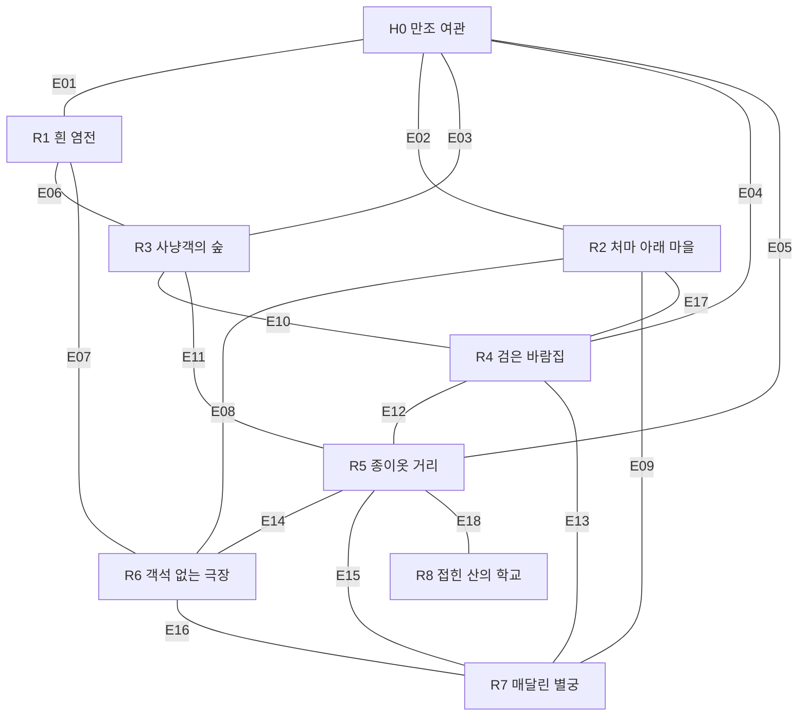
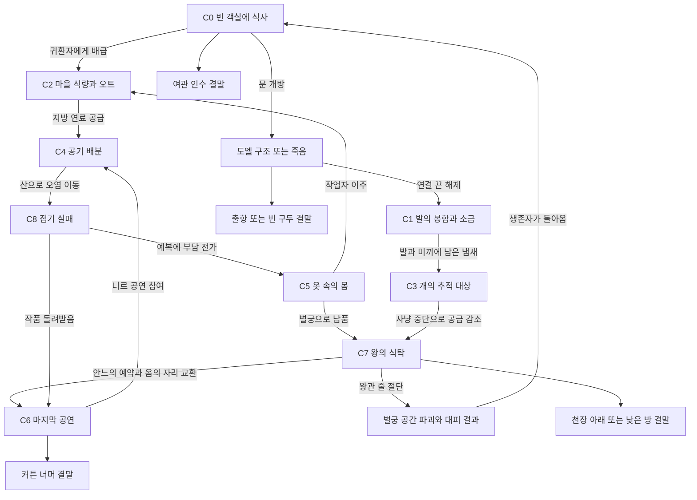

# 새 세계 지도·독립 집필 정본 v0.2

상태: 제작 초안, 사용자 내용 승인 전. [World 초안](../15_NEW_WORLD.md)의 지리·참여자·사건을 상세 집필의 공통 입력으로 사용한다. 이 파일은 그림 생성 입력이나 런타임 콘텐츠가 아니다. 통합 담당만 수정한다.

## 1. 큰 지도

북쪽이 산, 남쪽이 바다다. x/y는 지도 도식 좌표로 실제 이동 단위가 아니다. 화면은 지면 하향 60도 정사영이며 아래 배치도를 그대로 배경으로 그리지 않는다.

| 지역 | 도식 중심(x,y) | 지세 / World의 장면 구역 |
|---|---|---|
| H0 만조 여관 | (0,0) | 해안 둔덕; 세탁실→식당→복도→마당→지붕 |
| R1 흰 염전 | (-3,2) | 조간대; 말뚝길→채염판→창고→구덩이→바닷문 |
| R2 처마 아래 마을 | (-4,0) | 해안 함몰부; 기울어진 집→부엌→우물→빨랫배→묻힌 집 |
| R3 사냥객의 숲 | (-3,-3) | 북서 구릉; 개장→오두막→성상→고기길→빈 사냥터 |
| R4 검은 바람집 | (0,-3) | 절벽 내부; 송풍실→계단→필터실→성가석→막힌 출구 |
| R5 종이옷 거리 | (3,-2) | 산 아래 계단 거리; 재단집→염색 물길→건조대→작업장→비탈 |
| R6 객석 없는 극장 | (3,2) | 바다 향한 절벽; 표창구→무대→객석 터→분장실→지하 입 |
| R7 매달린 별궁 | (5,0) | 동쪽 절벽 상단; 계단→식사방→초상 복도→왕의 방→천장 |
| R8 접힌 산의 학교 | (4,-5) | 동북 산; 평평한 오르막→직조실→접기실→절단실→빠진 교실 |

화살표 없는 링크는 양방향 통로다. 조건과 폐쇄 후 귀환은 World §3.1을 따른다. 입구 다섯 개와 후반 우회 고리를 삭제하지 않는다.

## 2. 뒤틀림을 만드는 규칙

이것은 게임에 나오는 설명이 아니라 집필자가 검사하는 제작 절차다. 모든 사건을 한 수식으로 생성하지 않는다.

1. **당사자의 구체 행동을 먼저 적는다.** 어떤 장소에서 누구 손으로 무엇을 만지고, 왜 지금 멈추지 못하는가. '권력의 모순', '정체성 위기'는 행동을 대신하지 못한다.
2. **어긋나는 지점을 고른다.** 인식/몸/물질/공간/관습/시간 중 실제 사건에 필요한 것만 고른다. 모든 축을 한 사건에 넣지 않는다.
3. **핵심 상호작용의 뒤틀림은 행위에 드러낸다.** 모양만 바뀐 문, HP만 높은 살덩이, 공략이 같은 이름 다른 보스로 핵심 사건을 채우지 않는다. 무엇을 자르고 어디에 놓고 누구를 데려가는지가 달라져야 한다. 분위기와 생활의 모든 디테일에 기능·보상·분기를 강제하는 규칙은 아니다.
4. **물질의 행방을 제작 정본에 적는다.** 없어진 몸·먹이·옷·열·물은 어떻게 남고 누가 처리하는가. 일부 잔해는 다시 만날 수 있지만, 모든 잔해에 접근·조작·정답 확인을 보장하지 않는다. 목격만 가능한 현상과 영구히 닿지 않는 곳도 둔다.
5. **인물은 자기에게 중요한 것에 반응한다.** 전원이 놀라거나 전원이 무덤덤한 문법을 반복하지 않는다. 자신의 옷을 걱정하거나 웃음을 참거나 다른 사람을 탓하는 구체 반응을 쓴다.
6. **인과의 일부를 실제로 잃게 한다.** 먼저 완전한 제작 인과를 작성하고, 사라진 증언·공간·물건을 지정한다. 삭제한 자리에 정답 해설을 다른 NPC로 옮기지 않는다.
7. **인접 사건과 비교한다.** 직전 사건과 같은 '도와줌→다른 사람 희생', '소중한 사람을 먹음', '기관이 인정 안 함', '몸이 합쳐짐'이면 재료·결과 이름만 바꿔 통과시키지 않는다. 관계나 조작, 피해의 발생 구조를 다시 쓴다.
8. **불쾌함을 정당화하지 않는다.** 신체적 역겨움에 매번 철학적 효용이 있어야 하는 것은 아니다. 반대로 피/내장 수식어를 늘리는 것으로 사건을 완성하지도 않는다.

검수에는 [BLACK SOULS 2 조사](../../../../docs/research/top_down_action_rpg/BLACK_SOULS_2_RESEARCH.md)와 최근 인터뷰 사례를 사용한다. 원작 인물·대사·사건 자체를 변장 복제하지 않는다.

### 탈락 질문

- 이름과 살/피 단어를 지우면 평범한 배달·허가·구출 퀘스트만 남는가?
- 인물 소개 첫 문장으로 사건의 도덕적 결론을 예상할 수 있는가?
- 다른 지역 인물 이름을 넣어도 대사와 선택지가 그대로 성립하는가?
- 플레이어는 무슨 일이 일어났는지 경험하지 않고 설명만 받는가?
- 애정과 생존이 숫자 한 개로 자동 보장되는가?
- 장면의 고유성을 설명할 때 형용사밖에 없는가?

해당하면 `REVISE`로 남긴다. 이를 통과했다고 사용자 취향 검수를 통과한 것은 아니다.

## 3. 플로우차트 선행 계약

최종 조건 수치보다 먼저 교차 사건의 입력/출력과 순서를 고정한다. 아래 흐름은 가능한 연결이고, 모든 플레이에서 자동 실행되는 연쇄가 아니다. 실제 효과는 사건 조건과 NPC 생존을 다시 확인한다.

재귀 자동 실행 금지: C6→C4 같은 재진입은 새 플레이어 행동/새 공연이 있을 때만 평가한다. 이미 소비된 식량·사망·납품을 재방문만으로 중복 적용하지 않는다. 이것은 새로운 구현 규칙이 아니라 기존 원자적 결과/저장 계약의 콘텐츠 적용이다.

| 연결 | 선행 사실 | 즉시 남는 것 | 지연 실행 조건 | 막거나 바꾸는 행동 |
|---|---|---|---|---|
| C0→C2 | 귀환자 배급 유지 | 음식 감소 | 다음 배급 사건 | 새 재료 확보/귀환자 이주 |
| C2→C4 | 연료 통을 소비/파괴 | 분산기 연료량 감소 | 다음 분산 작업 | 대체 연료/순환 전환 |
| C4→C8 | 산으로 오염 전환 | 배관 방향·산 농도 변화 | 학생 다음 실습 | 필터·실습 중지·농도 분산 |
| C8→C5 | 페른이 살아 있고 부담 전가 선택 | 예복의 숨은 연결 | 그 예복 수선/착용 | 작품 회수·연결 절단 |
| C5→C7 | 예복 완성·납품 | 궁의 옷과 접근 상태 | 왕 기립/급식 | 납품 중단·다른 틀 사용 |
| C3→C7 | 사냥 공급 중단 | 궁 재고 감소 | 다음 급식 사건 | 다른 식량·왕 급식 중단 |
| C7→C6 | 안느 생존·식사 거부 뒤 공연 예약 | 무대에 맡긴 옷과 옮긴 의자 | 옴이 관객 자리로 이동 | 옷 반환·등솔기 절단·공연 중단 |
| C6→C4 | 니르 생존·공연 참여 | 호흡 부담/박자 변화 | 다음 성가 장치 작동 | 쉬기·대체 응답·역풍 차단 |
| R→C0 | 별궁 파괴·대피 생존 | 여관 피난자 배치 | 다음 배급/객실 방문 | 빈 방 확보·다른 거처 |

각 담당은 이 조건을 다른 인물의 대사로 자동 충족시키지 않는다. 조건 변경이 필요하면 root에게 제안하며 자신의 파일에 새 정본처럼 쓰지 않는다.

## 4. 지역 담당의 납품

지역 한 명이 다음 전체를 소유한다. 일부를 '분위기에 맞게'로 넘기지 않는다.

1. 5구역 각각의 크기·층고·시점 기준, 출입 위치·폭·방향, 통행·가림·상호작용 위치와 내부 연결표.
2. 지역 주민의 먹기·자기·일하기·죽은 몸 처리, 물건과 재료의 들어오고 나가는 길.
3. 모든 주요 물건의 기본 상태·만질 수 있는 행동·즉시 결과·지연 결과·빈 자리·재방문 상태.
4. NPC 입장/퇴장/위치 조건. 인물 대사 정본을 중복 집필하지 않고 해당 인물 파일에 연결.
5. 적/조우/위험과 비전투 우회. 전투 수치 시스템을 새로 발명하지 않음.
6. 지도와 사건표에 걸린 외부 입력/출력·시간 순서·인물 사망 후 대체 통행과 영구 상실.
7. 제작자가 아는 사건 전말, 게임에 남길 흔적, 실제 삭제하는 문서·대사·공간.
8. 이미지 자산 목록·레이어·소리·두 재방문 차분. 이미지 생성은 하지 않음.
9. 시작→탐험→사건→실패/성공→재방문 플레이 과제. 미작성 항목과 판단이 필요한 사항을 명시.

## 5. 인물 담당의 납품

캐릭터 한 명의 외형/목소리/대사/행동/관계/죽음은 한 명이 소유한다.

1. 성인 외형: 비율·얼굴 면·머리·피부·손·옷의 구조와 실루엣, 소지품과 몸의 변화. A의 인물 정체성 복제 금지. B 원본·크롭 사용 금지.
2. 실제 욕구·혐오·버릇·말하지 않는 것·지식 경계·거짓말. 전원이 비밀을 가진 친절한 직원이 되지 않음.
3. 등장/재방문/관계/동행/서비스/거절/적대/죽음 직전/주변인 사망에 대한 실제 대사. 문서 페이지/선택/focus 계약 준수.
4. 행동별 선행 조건·플레이어 입력·물건/몸의 결과·지연 결과·취소/실패. 다른 인물의 결과를 임의 소유하지 않음.
5. 관계 전이와 생존 전이를 구별. 호감이 높아도 조건을 밟으면 죽음. 이미 죽은 인물의 연애 장면 출력 금지.
6. 지역 담당이 사용할 배치/이동/서비스 조건과 바뀌는 외형·소품. 인물 몸을 배경에 굽지 않음.
7. 각 대사와 장면의 전형성 검사 및 수정 내역. 요약문으로 대사 분량을 대신하지 않음.

## 6. 소유권과 진행

- root: 15_NEW_WORLD, 이 지도/플로우, 인터뷰 기록, 통합·충돌 해석.
- 지역 담당: `regions/<지역별칭>.md` 한 파일. 다른 지역·인물 파일 수정 금지.
- 인물 담당: `characters/<인물별칭>.md` 한 파일. 담당 인물 외 대사 정본 수정 금지.
- 별도 검토 담당: `REVISION_REVIEW.md`. 수정 제안만, 정본 직접 수정 금지.
- 현재 큰 지도와 플로우는 v0.2의 공통 초안으로 잠근다. v0.1 대비 C7→C6을 식량 전가에서 안느/옴의 사적 선택으로 변경했고, 니르·살무·오트의 직업 밖 행동을 World §13.1에 추가했다. H0/C0와 N01 인과는 바꾸지 않았다. 첫 지역/인물 상세를 통해 결함이 드러나면 root가 버전을 올린 뒤 다음 담당에게 전달한다. 아직 검수 안 된 상투적 개요를 45구역으로 자동 양산하지 않는다.
- 작업 완료 여부는 산출물을 직접 읽고 판단한다. 서브에이전트의 '완료' 메시지나 줄 수는 콘텐츠 완성 증거가 아니다.
